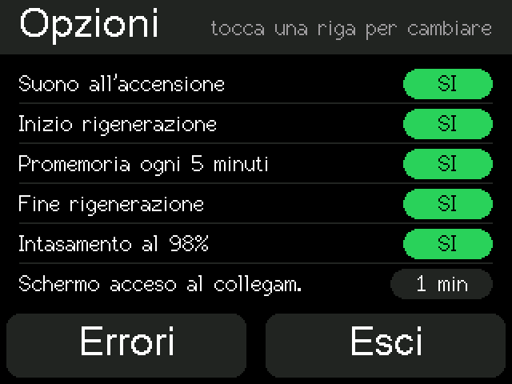

# Dashboard FAP (DPF) – ESP32 CYD

🇬🇧 [English](README.md) | 🇮🇹 **Italiano**

Piccolo display da cruscotto che legge in tempo reale lo stato del **filtro antiparticolato (FAP/DPF)** di un diesel FCA tramite un adattatore OBD2 Bluetooth LE e avvisa quando parte la **rigenerazione**, così non spegni il motore a metà.

Testato su **Fiat Tipo 1.6 Multijet (2019), centralina Bosch EDC17C69**.

*(schermate generate in simulazione con i font reali del display)*

---

## Funzioni

- **Pagina Guida**: temperatura e intasamento FAP in grande, barra colorata, più km dall'ultima rigenerazione, pressione differenziale, temperatura motore, numero di rigenerazioni.
- **Avviso rigenerazione**: barra rossa lampeggiante `RIGENERAZIONE xx%` / `NON SPEGNERE!` con avanzamento.
- **Pagina Dettagli**: tutti i valori con decimali e tempo medio di lettura.
- **Errori centralina**: lettura dei codici (ATTIVO / MEMORIZZATO / IN ATTESA / STORICO) con descrizione dei più comuni. Cancellazione con conferma, **solo a motore spento**, e verifica successiva.
- **Controllo automatico errori** a ogni collegamento (riquadro `N ERRORI`, senza suono).
- **Test guidato del sensore di pressione differenziale** (utile con P2002): minimo → 3000 giri in folle → motore spento. Il test riprende da solo se la scheda si riavvia (es. presa accendisigari che si spegne).
- **Schermo automatico**: dopo il collegamento all'adattatore resta acceso per il tempo scelto nella pagina Opzioni (10 s – 5 min, predefinito 1 min), poi si spegne dopo 10 s senza tocchi; si riaccende al tocco. Resta acceso durante la rigenerazione e con intasamento ≥ 98%.
- **Avvisi sonori** (buzzer opzionale): avvio, inizio rigenerazione, promemoria ogni 5 min, fine rigenerazione, intasamento 98%. Ogni suono si può disattivare dalla pagina **Opzioni**.
- **Log eventi** nella memoria interna (consultabile dal monitor seriale).

| Errori centralina | Test sensore | Opzioni |
|---|---|---|
|  |  |  |

## Hardware

| Componente | Note |
|---|---|
| **CYD ESP32-2432S028R** ("Cheap Yellow Display") | 2,8" ILI9341 320×240 con touch XPT2046 |
| **Adattatore OBD2 ELM327 Bluetooth LE** | testato con **Vgate iCar Pro BLE**. Quelli BT "classici" e i cloni economici potrebbero non funzionare |
| Alimentazione USB | presa accendisigari / USB dell'auto |
| *(opzionale)* buzzer **passivo** + cavo JST 1,25 mm 2 poli | sulla presa **SPEAK** della CYD |

### Collegamento buzzer
Il buzzer va sulla presa **SPEAK** (2 poli, JST 1,25 mm) della CYD, pilotata dall'amplificatore sul GPIO 26. Filo rosso sul **+** del buzzer, nero sul **–**. Serve un buzzer **passivo** (quello attivo suona solo a una frequenza).

Per verificare il collegamento c'è lo sketch [`tools/test_buzzer`](tools/test_buzzer/test_buzzer.ino).

## Installazione

1. Installa **Arduino IDE 2.x**.
2. *File → Preferenze → URL aggiuntivi*: `https://espressif.github.io/arduino-esp32/package_esp32_index.json`. Poi *Gestione schede* → installa **esp32** (Espressif). Va bene sia il core 2.x sia il 3.x.
3. *Gestione librerie* → installa **TFT_eSPI** (Bodmer) e **XPT2046_Touchscreen** (Paul Stoffregen).
4. Copia [`config/User_Setup.h`](config/User_Setup.h) **dentro la cartella della libreria TFT_eSPI** (es. `Documenti/Arduino/libraries/TFT_eSPI/`), sostituendo quello esistente.
5. Apri `firmware/DashboardFAP/DashboardFAP.ino`.
6. Scheda: **ESP32 Dev Module**. *Partition Scheme*: **Huge APP (3MB No OTA)**, perché lo sketch con il Bluetooth è grande.
7. Carica.

## Configurazione

All'inizio dello sketch, sezione `CONFIGURAZIONE - MODIFICA QUI`:

| Parametro | Default | Significato |
|---|---|---|
| `ELM_DEVICE_NAME` | `"IOS-Vlink"` | nome Bluetooth dell'adattatore |
| `ELM_MAC_ADDRESS` | `""` | vuoto = cerca per nome. Se non lo trova, mostra la lista dei dispositivi: tocchi il tuo e viene ricordato |
| `SUONI_ATTIVI` | `true` | `false` = nessun suono |
| `PROMEMORIA_RIGEN_MS` | 5 min | intervallo del promemoria durante la rigenerazione |
| `SCHERMO_TIMEOUT_MS` | 10000 | spegnimento schermo |
| `DURATA_RICERCA_S` | 15 | durata massima della ricerca dell'adattatore (si ferma appena lo trova) |
| `SOGLIA_INTAS_SCHERMO` | 98 | % di intasamento oltre cui lo schermo resta acceso |

## Uso

- **Navigazione**: Guida → *tocco* → Dettagli → *tocco* → Opzioni → pulsante **Errori** → pagina Errori (Leggi / Cancella / Test / Esci).
- **Monitor seriale** (115200 baud):
  - `DUMP`: stampa il log eventi
  - `SUONI`: fa sentire tutti gli avvisi
  - `CANCELLA`: svuota il log
  - `DIMENTICA`: dimentica l'adattatore scelto dalla lista

## Dati letti (PID)

CAN 29 bit 500 kbit/s, richieste UDS `22` (ReadDataByIdentifier), header `18DA10F1`, risposte da `18DAF110`.

| PID | Valore | Formula | Unità |
|---|---|---|---|
| `22380B` | Avanzamento rigenerazione | `(A*256+B)*100/65535` | % |
| `2218DE` | Temperatura FAP | `(A*256+B)*0.02-40` | °C |
| `2218E4` | Intasamento FAP | `(A*256+B)*1000/65535` | % |
| `2218E2` | Pressione differenziale | `(A*256+B)-32767` | mbar |
| `221003` | Temperatura motore | `(A*256+B)*0.02-40` | °C |
| `223807` | Km dall'ultima rigenerazione | `(A*65536+B*256+C)*0.1` | km |
| `2218A4` | Numero rigenerazioni | `A*256+B` | – |

Regole usate:
- **Rigenerazione in corso**: avanzamento > 0,1%.
- **Lettura errori**: UDS `19 02 FF`, con fallback OBD `03`/`07`.
- **Cancellazione errori**: UDS `14 FF FF FF`, con fallback OBD `04`; consentita solo con giri < 50.

## Compatibilità

Provato solo su Fiat Tipo 1.6 Multijet con EDC17C69. Gli stessi PID sono documentati per altri diesel FCA (Alfa Giulietta / Giulia / Stelvio, Jeep, ecc.), ma **non è garantito** che funzionino: se provi su un'altra auto, apri una *Issue* con il risultato.

## ⚠️ Avvertenze

- Progetto amatoriale, **senza alcuna garanzia. Uso a tuo rischio.**
- Serve **solo a monitorare**: non modifica parametri della centralina e non è pensato per disattivare o manomettere il FAP.
- Cancellare un codice errore non ripara il guasto: se torna, va fatto controllare.
- Non usare il touch mentre guidi.

## Crediti

PID e formule ricavati da fonti pubbliche, poi verificati sull'auto:
- [dixtone/GiuliaAndStelvioDPFMonitor](https://github.com/dixtone/GiuliaAndStelvioDPFMonitor) (MIT)
- discussioni sui PID FAP Alfa Giulietta / Fiat su forum Torque, alfistas.es e clubalfa.it
- [ELMduino](https://github.com/PowerBroker2/ELMduino) (issue #235 sui PID DPF FCA)
- librerie [TFT_eSPI](https://github.com/Bodmer/TFT_eSPI) e [XPT2046_Touchscreen](https://github.com/PaulStoffregen/XPT2046_Touchscreen)

## ☕ Supporta il progetto

Il progetto è gratuito e lo resterà. Se ti è stato utile (magari ti ha evitato una rigenerazione interrotta o un giro in officina) e vuoi offrirmi un caffè: **[paypal.me/drkontos](https://paypal.me/drkontos)**

Anche una ⭐ sul repository o una segnalazione di compatibilità con un'altra auto sono un ottimo aiuto.

## Licenza

[MIT](LICENSE)
