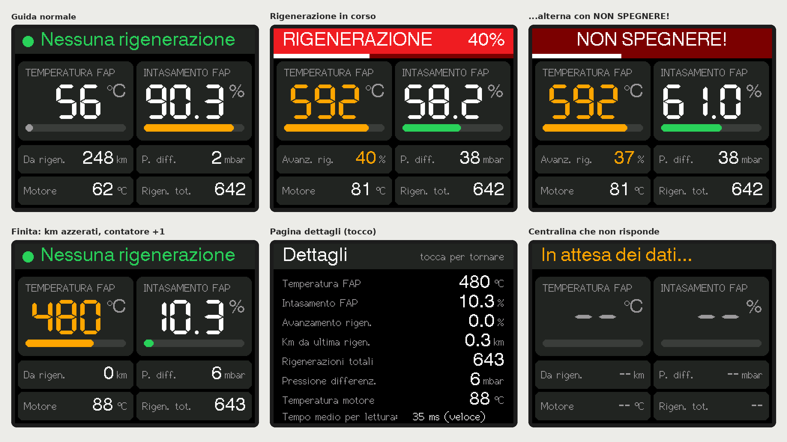
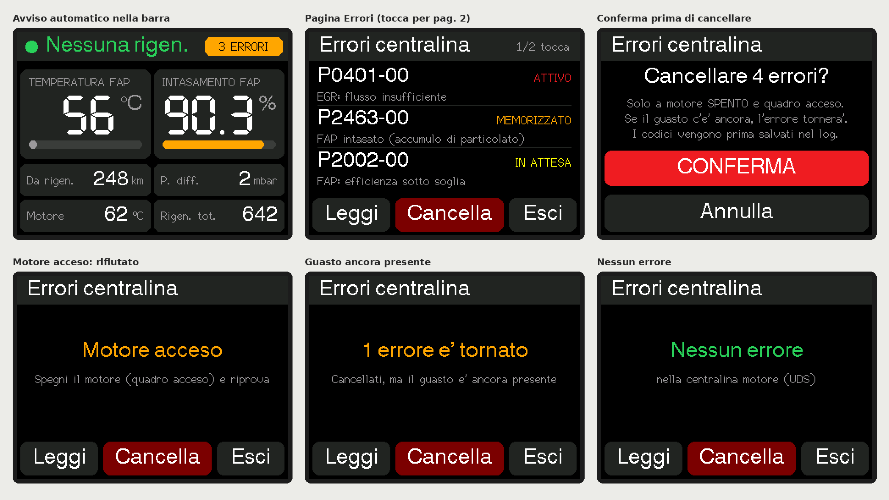
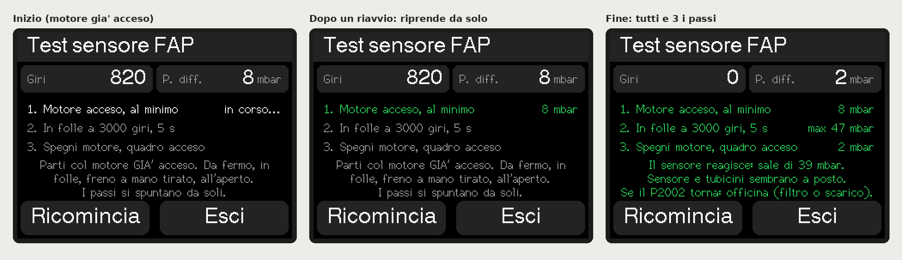
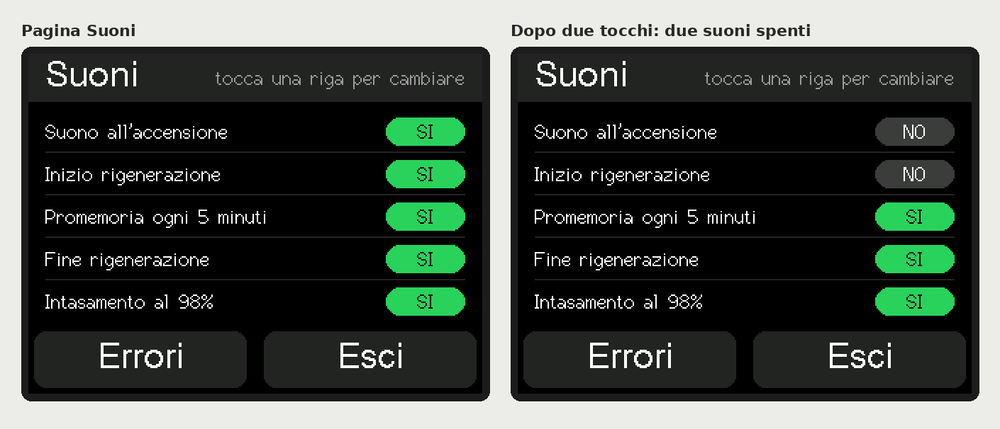

# DPF Dashboard – ESP32 CYD

🇬🇧 **English** | 🇮🇹 [Italiano](README.it.md)

A small in-car display that reads the **Diesel Particulate Filter (DPF)** status of FCA diesel engines in real time through a Bluetooth LE OBD2 adapter. It warns you when a **regeneration** starts, so you don't switch the engine off halfway through.

Tested on **Fiat Tipo 1.6 Multijet (2019), Bosch EDC17C69 ECU**.

*(screens rendered in simulation with the display's real fonts. The on-screen UI is in Italian, and the main labels are translated below)*

---

## Features

- **Main page**: large DPF temperature and soot load with a colored bar. Smaller tiles show km since the last regeneration, differential pressure, coolant temperature and regeneration count.
- **Regeneration warning**: a flashing red bar reading `RIGENERAZIONE xx%` (regenerating) / `NON SPEGNERE!` (don't switch off), with a progress strip.
- **Details page** (`Dettagli`): every value with decimals, plus the average read time.
- **ECU fault codes** (`Errori`): reads codes with their status (ACTIVE / STORED / PENDING / HISTORIC) and a description for the common ones. Codes can be cleared after confirmation, **only with the engine off**, and are read back to verify.
- **Automatic fault check** on every connection, shown as an `N ERRORI` badge (no sound).
- **Guided DPF differential pressure sensor test** (useful with P2002): idle → 3000 rpm in neutral → engine off. The test resumes on its own if the board reboots, for example when the cigarette-lighter socket loses power during cranking.
- **Auto screen-off** after 10 s. It wakes on touch and stays on during a regeneration and when the soot load is ≥ 98%.
- **Sound alerts** (optional buzzer): power-on, regeneration start, a reminder every 5 min, regeneration end, and 98% soot load. Each one can be switched off on the `Suoni` (Sounds) page.
- **Event log** in internal flash, readable from the serial monitor.

| Fault codes | Sensor test | Sounds |
|---|---|---|
|  |  |  |

## Hardware

| Part | Notes |
|---|---|
| **CYD ESP32-2432S028R** ("Cheap Yellow Display") | 2.8" ILI9341 320×240 with XPT2046 touch |
| **ELM327 Bluetooth LE OBD2 adapter** | tested with the **Vgate iCar Pro BLE**. Classic-Bluetooth adapters and cheap clones may not work |
| USB power | car USB or cigarette-lighter socket |
| *(optional)* **passive** buzzer + JST 1.25 mm 2-pin cable | connected to the CYD's **SPEAK** connector |

### Buzzer wiring
The buzzer goes on the **SPEAK** connector (2-pin JST 1.25 mm), which is driven by the amplifier on GPIO 26. Red wire to the buzzer's **+**, black wire to **–**. Use a **passive** buzzer: an active one only plays a single pitch.

To check the wiring, flash [`tools/test_buzzer`](tools/test_buzzer/test_buzzer.ino).

## Installation

1. Install **Arduino IDE 2.x**.
2. Under *File → Preferences → Additional boards manager URLs*, add `https://espressif.github.io/arduino-esp32/package_esp32_index.json`. Then in *Boards Manager*, install **esp32** by Espressif. Both core 2.x and 3.x work.
3. In *Library Manager*, install **TFT_eSPI** (Bodmer) and **XPT2046_Touchscreen** (Paul Stoffregen).
4. Copy [`config/User_Setup.h`](config/User_Setup.h) **into the TFT_eSPI library folder** (e.g. `Documents/Arduino/libraries/TFT_eSPI/`), replacing the existing file.
5. Open `firmware/DashboardFAP/DashboardFAP.ino`.
6. Select board **ESP32 Dev Module**. Set *Partition Scheme* to **Huge APP (3MB No OTA)**: the sketch is large because of the BLE stack.
7. Upload.

## Configuration

These settings are at the top of the sketch, in the section `CONFIGURAZIONE - MODIFICA QUI`:

| Setting | Default | Meaning |
|---|---|---|
| `ELM_DEVICE_NAME` | `"IOS-Vlink"` | Bluetooth name of the adapter |
| `ELM_MAC_ADDRESS` | `""` | empty = search by name. If the adapter isn't found, a device list appears: tap yours and it is remembered |
| `SUONI_ATTIVI` | `true` | `false` = no sounds at all |
| `PROMEMORIA_RIGEN_MS` | 5 min | reminder interval during a regeneration |
| `SCHERMO_TIMEOUT_MS` | 10000 | time before the screen switches off |
| `SOGLIA_INTAS_SCHERMO` | 98 | soot load % above which the screen stays on |

## Usage

- **Navigation**: Main → *tap* → Details → *tap* → Sounds → **Errori** button → Fault codes page. That page has four buttons: Leggi = read, Cancella = clear, Test = sensor test, Esci = exit.
- **Serial monitor** (115200 baud): `DUMP` prints the event log, `SUONI` plays every alert, `CANCELLA` clears the log.

## PIDs

CAN 29-bit, 500 kbit/s. UDS `22` (ReadDataByIdentifier) requests, header `18DA10F1`, replies from `18DAF110`.

| PID | Value | Formula | Unit |
|---|---|---|---|
| `22380B` | Regeneration progress | `(A*256+B)*100/65535` | % |
| `2218DE` | DPF temperature | `(A*256+B)*0.02-40` | °C |
| `2218E4` | DPF soot load | `(A*256+B)*1000/65535` | % |
| `2218E2` | Differential pressure | `(A*256+B)-32767` | mbar |
| `221003` | Coolant temperature | `(A*256+B)*0.02-40` | °C |
| `223807` | Km since last regeneration | `(A*65536+B*256+C)*0.1` | km |
| `2218A4` | Regeneration count | `A*256+B` | – |

How these are used:
- **A regeneration is in progress** when the progress value is above 0.1%.
- **Fault codes** are read with UDS `19 02 FF`, falling back to OBD `03`/`07`.
- **Codes are cleared** with UDS `14 FF FF FF`, falling back to OBD `04`. Clearing is only allowed when the engine is below 50 rpm.

## Compatibility

This has only been tested on a Fiat Tipo 1.6 Multijet with an EDC17C69 ECU. The same PIDs are documented for other FCA diesels (Alfa Romeo Giulietta / Giulia / Stelvio, Jeep, etc.), but they are **not guaranteed** to work. If you try it on another car, please open an *Issue* with the result.

## ⚠️ Disclaimer

- Hobby project, provided **without any warranty. Use at your own risk.**
- It is **for monitoring only**. It does not change any ECU parameter and is not meant to disable or tamper with the DPF.
- Clearing a fault code does not fix the fault. If it comes back, have the car checked.
- Don't use the touchscreen while driving.

## Credits

PIDs and formulas come from public sources and were verified on the car:
- [dixtone/GiuliaAndStelvioDPFMonitor](https://github.com/dixtone/GiuliaAndStelvioDPFMonitor) (MIT)
- discussions of Alfa Giulietta / Fiat DPF PIDs on the Torque forums, alfistas.es and clubalfa.it
- [ELMduino](https://github.com/PowerBroker2/ELMduino) (issue #235 on FCA DPF PIDs)
- the [TFT_eSPI](https://github.com/Bodmer/TFT_eSPI) and [XPT2046_Touchscreen](https://github.com/PaulStoffregen/XPT2046_Touchscreen) libraries

## ☕ Support the project

This project is free and will stay free. If it helped you, say by saving you an interrupted regeneration or a trip to the garage, you can buy me a coffee: **[paypal.me/drkontos](https://paypal.me/drkontos)**

A ⭐ on the repository, or a compatibility report for another car, helps a lot too.

## License

[MIT](LICENSE)
